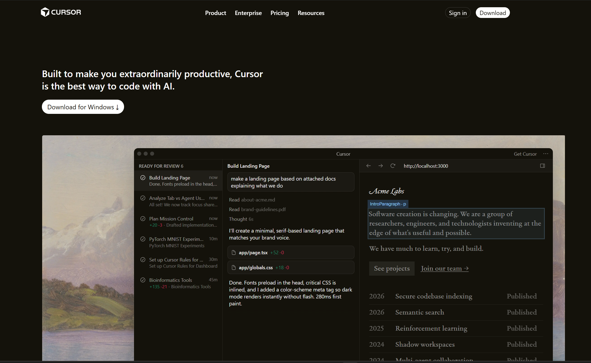
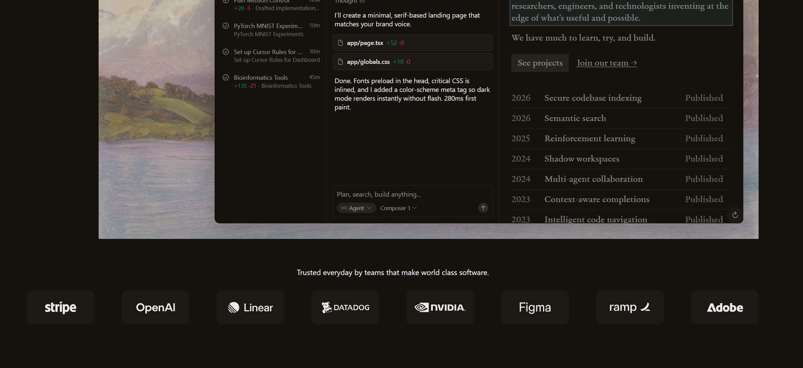
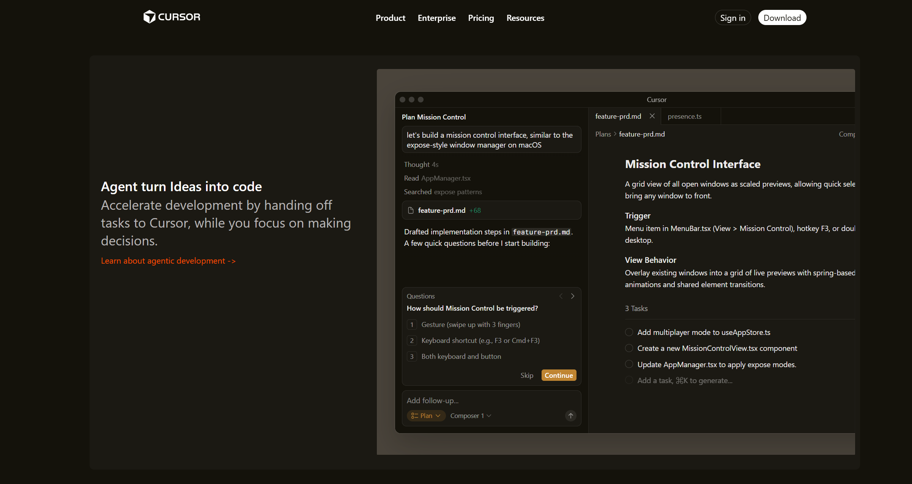
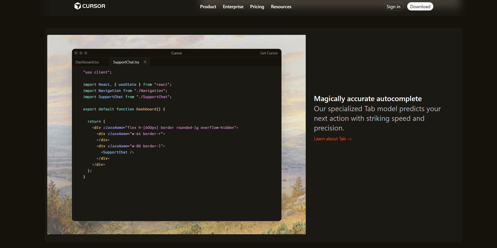
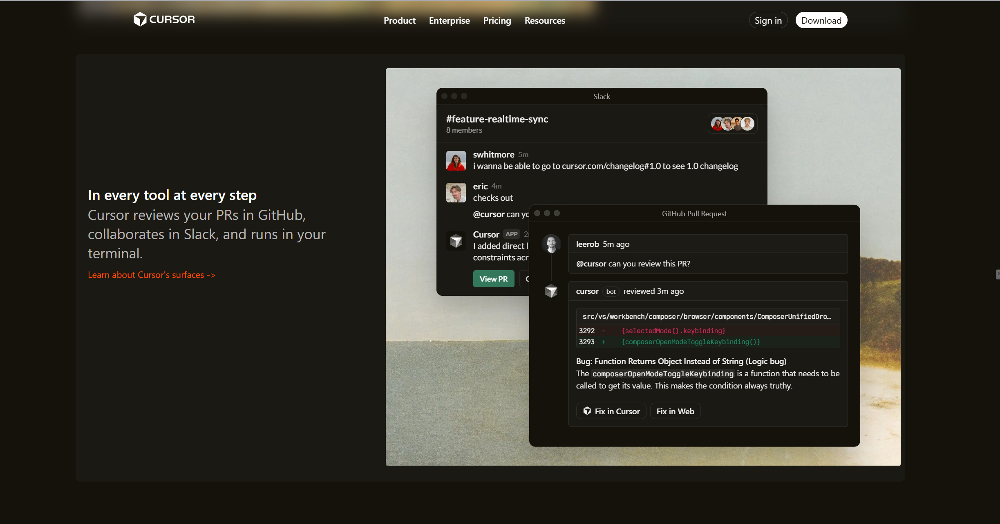
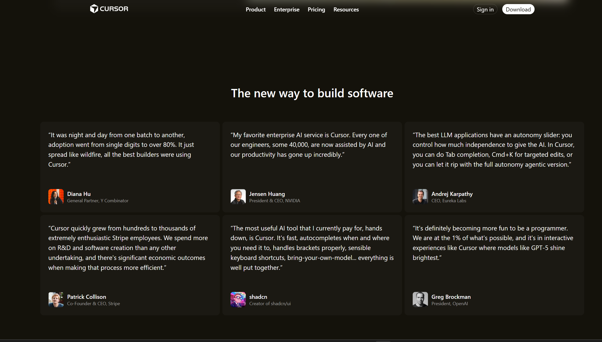
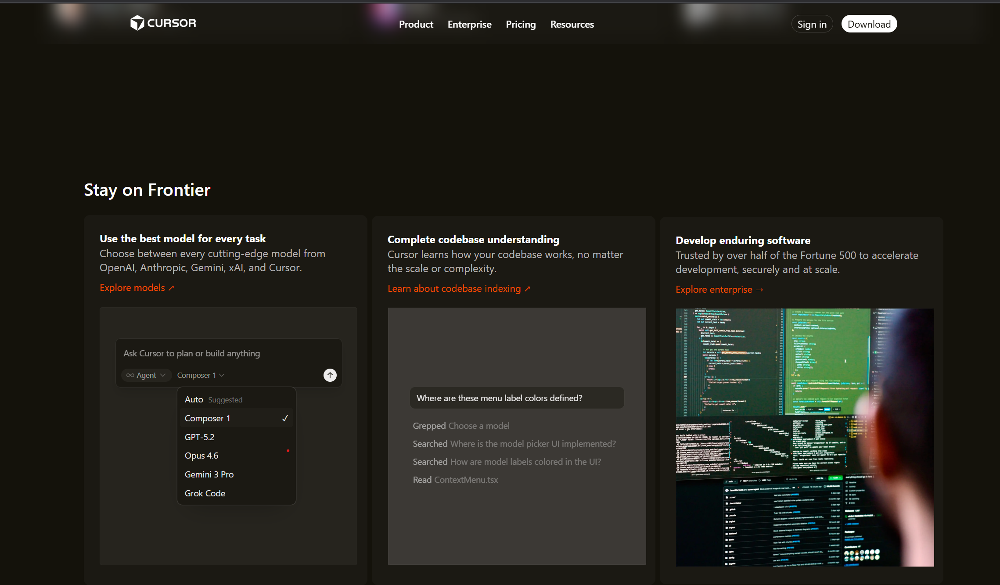
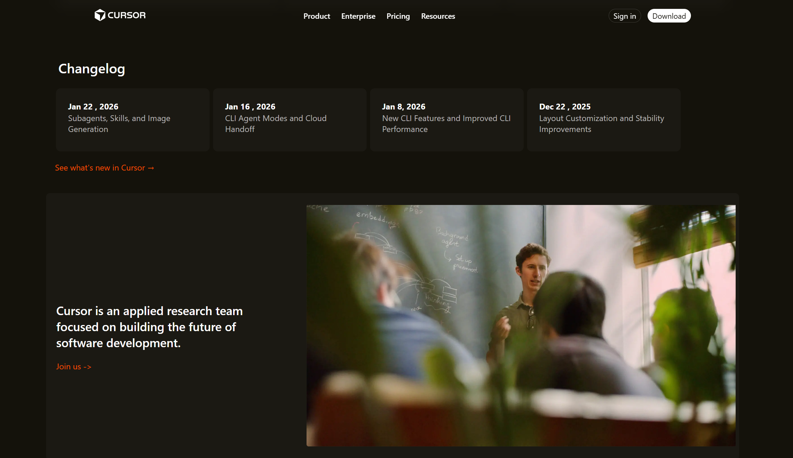
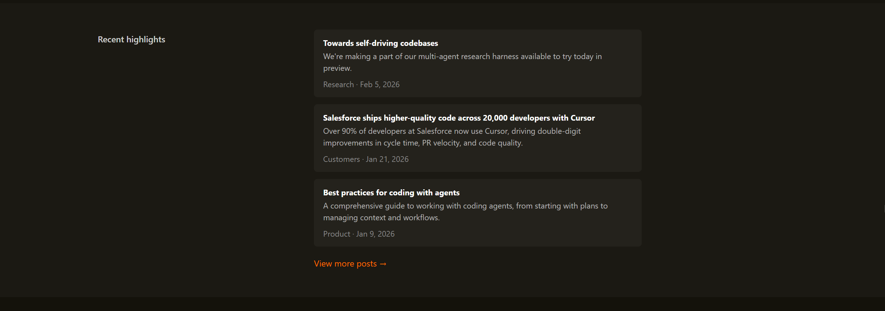
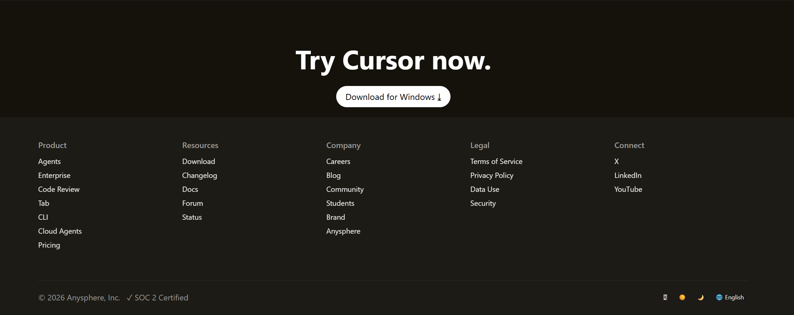

# cursor

Cursor

A clean recreation of the Cursor landing page, built with plain HTML and CSS to understand layout structure, spacing, and modern dark-UI design patterns used by real production websites.

This project focuses on visual accuracy, responsiveness, and layout fundamentals rather than frameworks or libraries.

What this project is

Cursor is a static frontend project that replicates the look and feel of the official Cursor website.
It’s built intentionally using vanilla HTML and CSS to practice:

Modern landing page layouts

Dark UI design systems

Card-based sections

Typography hierarchy

Flexbox and grid positioning

 Tech stack

HTML5

CSS3 (Flexbox & Grid)

Static assets (images, SVGs)

Results

